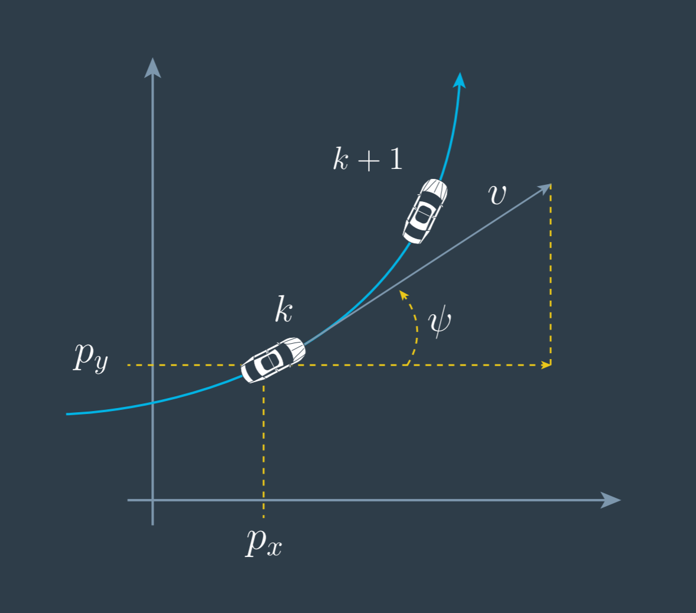
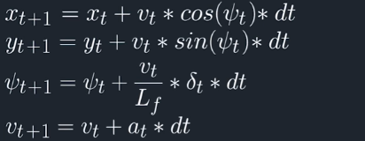
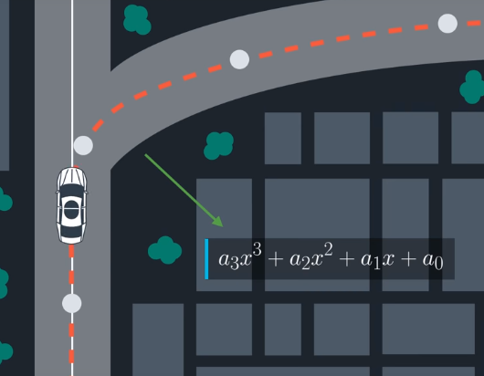
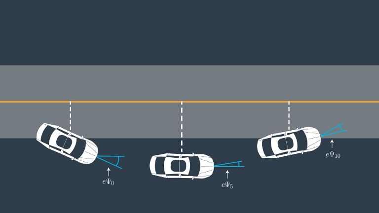
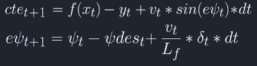
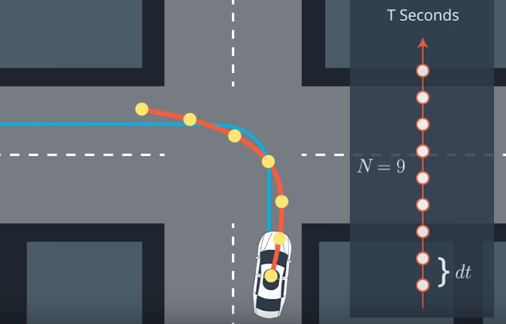

This repository contains the solution for the Model Predictive Control (MPC) Project of the second term of Udacity's Self-Driving Car Engineer Nanodegree Program. This README explains the project and the solution.


[this video](report/img/delta.svg)


# 1. Vehicle Kinematic Model

## 1.1 Vehicle state
The implemented controller uses a simple kinematic model without the inclusion of dynamic forces. The vehicle state is given by 4 variables: x and y position, orientation  and velocity (as seen in the figure below).


Vehicle state variables (adapted from lecture video).

These variables are actuated upon by the control inputs, which in our model are the throttle _a_ and the steering .

The state transition between consecutive time steps (with _dt_ as the interval between steps) is given by the following equations.

<!--  . dt
)


 -->



State transition equations (from video lecture).

Here  is the distance between the front of the vehicle and the center of gravity.

## 1.2 Errors

To implement a controller we need to give it feedback. In this project 2 feedback variables were used: the Cross Track Error (CTE)  and the orientation error . These errors are computed in reference to a polynomial interpolated to the received trajectory waypoints. In this project a  degree polynomial was used.



Representation of the fitted polynimal. The dashed red line is a plot of the polynimal. The light grey dots are the trajectory waypoints. Figure taken from video lecture.




Dashed white line represents the CTE. Figure taken form video lecture.

The state transition of these errors is given by the following equations.



Error transition equations (from video lecture).

Here, _f_ is the fitted polynimial function, so _f_() is the desired  position for a given  and   is the desired orientation at time step _t_, which is given by the tangential angle of the polynomial at , i.e.

<!-- \psi des_t = arctan(f'(x_t)) -->


## 1.3 Actuator constraints
The control variables represent physical systems which have physical constraints. In our system, the steering angle is topped at 25º, being in the interval [-25º, +25º], and the throttle within the interval [-1, 1], where -1 is full breaking and 1 is full acceleration.

# 2. Controller

## 2.1. Overview

MPC is a kind of controller that uses a receding horizon _T_, meaning that given the system model, it computes the system state into the future for a finite number of steps _N_, with a certain time interval _dt_ between them, and optimizes the control variables at each of those time steps according to a cost function. As such, the MPC controller has 2 essential components: the system model and the cost function. The output of the controller are the control variables at time step _t=0_ (the time step where the system "actually is").



Representation of the receding horizon prediction. Blue line is the fitted trajectory. Yellow points are the horizon time steps. Figure adapted from video lectures.

In this project the Ipopt (Interior Point OPTimizer) was used to find the control values through the minimization of the cost function.

## 2.2. Designing the cost function

The cost function is a fundamental piece for an effective MPC controller. The aim for this project's controller is to make the car drive in the center of the lane, with a smooth variation of the orientation and velocity while going as fast as possible.

Each of the components of the cost function has an associated weight. The higher the weight the more "aggressive" the controller will be at finding control inputs that follow that objective.


### 2.2.1. Keeping at the center of the lane

The 2 most obvious components of the cost function are the feedback errors computed: the CTE and the orientation error.

```c++
fg[0] += K_cte * CppAD::pow(vars[cte_start + t], 2);
fg[0] += K_epsi * CppAD::pow(vars[epsi_start + t], 2);
```

Here `fg[0]` is the cost function, `vars[cte_start + t]` and `vars[epsi_start + t]` are the predicted CTE and orientation error at time step `t` in the prediction horizon. `K_cte` and `K_epsi` are the weights of these 2 components.

### 2.2.2. Addressing zero throttle

As it is, we have the problem that the controller might send a throttle actuation value of 0 when it finds a position where the CTE and orientation error are close to 0. This happens because a velocity of 0 is not penalized. To address this problem, we had a component that penalizes control inputs that deviate from a certain reference velocity.

```c++
fg[0] += K_v * CppAD::pow(vars[v_start + t] - v_ref, 2);
```

Where `vars[v_start + t]` is the predicted velocity, `v_ref` is the reference velocity that the car should have and `K_v` is the weight of this component.

### 2.2.3. Extreme control input variations

As stated before, one of the objectives for the controller is to have a smooth driving. For that end, the control inputs need to be included in the cost function. We will start by penalizing control inputs that have values close to their limits (e.g. maximum steering to the right, full breaking).

```c++
fg[0] += K_actuator_delta * CppAD::pow(vars[delta_start + t], 2);
fg[0] += K_actuator_a * CppAD::pow(vars[a_start + t], 2);
```

### 2.2.4. Smoother driving

To further smooth the driving, the control inputs at any given time step _t_ should be similar to those from the previous time step _t-1_.

```c++
fg[0] += K_like_before_delta * CppAD::pow(vars[delta_start + t + 1] - vars[delta_start + t], 2);
fg[0] += K_like_before_a * CppAD::pow(vars[a_start + t + 1] - vars[a_start + t], 2);
```

### 2.2.5. Reducing velocity on high error
As any driver knows, a reduced velocity while on curves is important for safe and smooth driving. To that end, we add a component that penalized a combined high velocity with high CTE and high orientation error (implemented by multiplying the velocity with each of the errors). When any of these errors is large enough, the car will start steering to reduce them. While doing so, it should reduce its speed.

```c++
fg[0] += K_fast_turn * CppAD::pow(vars[v_start + t] * vars[epsi_start + t], 2);
fg[0] += K_fast_away * CppAD::pow(vars[v_start + t] * vars[cte_start + t], 2);
```

These two components will be referenced as _fast away_ and _fast turn_, respectevely, for the rest of this document.

## 2.3. Horizon parameters
The final piece for the controller is to choose a good number of time steps _N_ and time interval _dt_ for the desired horizon length _T_. There is a tradeoff to be considered here. Having a high number of steps means the controller will be slow and will add latency to the system - which is harmful for the performance. Having a small _T_ means that the controller will not optimize the immediate control inputs to future situations - we could imagine this being bad on tight curves since the controller would not adjust the inputs with them in the horizon.

# 3. Implementation
To reduce the number of compilations necessary to test hypothesis and setups, all the controller parameters (cost function weights, reference velocity, _N_, _dt_, system latency, model latency) are read from a text file `mpc.txt`. This code was added to a new method `MPC::init` of the `MPC` class.

When the controller is initialized it prints the values of all the relevant parameters for the user to inspect. It should be noted that the system latency is not hardcoded to 100 ms anymore as it was before. This allowed for easier experimentation with the system and model latencies.

Three scripts were added to the project to simplify the process of cleaning the workspace, compiling and running the controller: `clean.sh`, `build.sh` and `run.sh`. The `run.sh` script expects a `mpc.txt` file to exist in the project folder.

# 4. Simulation

## 4.1. No system latency

The tuning of the controller started with a setup where no system latency (delay in the actuator inputs) was added. This eased the process of gaining intuition on the effect of each parameter. The result of this first experimentation can be seen on [this video](https://youtu.be/9bZ9r-qF7BM). The parameters used are on [this configuration file](video/udacity_no_latency_good.txt).

The initial setup was such that all weights were set to 1, for the exception of the _fast turn_ and _fast away_ weights which were not used. The reference velocity was set to a low value and I used 25 time steps spaced by 50 ms. From these configuration, the car started to wobble wildly shortly after the simulation start, as the steering command values varied rapidly and steeply in a short time.

This lead to an increase of several orders of magnitude of the steering command component weight. With such a configuration the car could complete a loop around the track, but it was slow. After increasing the reference speed, the car had problems recovering from tight curves, which meant the weight of the errors had to be adjusted. This helped and after the _fast turn_ component was added the driving became safer and closer to the lane center as the speed was decreased before and during turns. It was found that the number of time steps and interval between steps could be adjusted such that a _N=8_ and _dt=0.1_ performed well while also making the computation significantly faster. The final parameters can be consulted below.

```
# print received telemetry and outgoing
z 100
# N
a 8
# dt
b 0.1
# reference velocity
c 120
# K cte
d 500
# K epsi
e 10
# K v
f 1
# K actuator delta
g 10000
# K actuator Acceleration
h 1
# K like before delta
i 1
# K like before Acceleration
j 1
# fast turn
k 10
# fast away
l 0
# model latency (ms)
m 0
# sys latency (ms)
n 0
```

## 4.2. 100ms system latency
